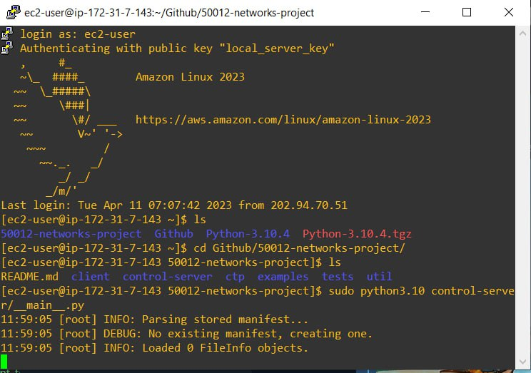

### Starting up the server in EC2 
cd into the folder containing the **local server key pem file**.
There is no password, username is ec2-user
To ssh into the ec2 instance, run the command: `ssh -i local_server_key.pem ec2-user@ec2-52-62-118-161.ap-southeast-2.compute.amazonaws.com`

Once inside, `cd` into `Github/50012-networks-project/`
run the server by entering the command: `sudo python3.10 control_server/__main__.py`

Output should be something like this:

